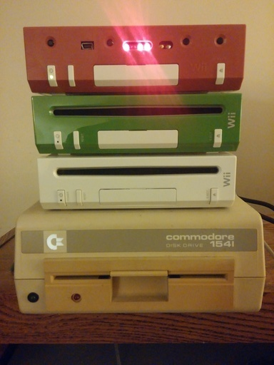

# RVT-H Tool

This is an open-source tool for managing RVT-H Reader consoles.

[](https://www.gnu.org/licenses/old-licenses/gpl-2.0.en.html)<br>
[](https://travis-ci.org/GerbilSoft/rvthtool)
[](https://ci.appveyor.com/project/GerbilSoft/rvthtool/branch/master)

-

## Current Features

* Lists all disc images currently installed on the RVT-H system.
* Can find "deleted" images that aren't accessible on the RVT-H but are still
  present on the HDD, and has an option to undelete these images.
  * Can undelete any image deleted by rvtwriter, which only clears the
    bank table entry.
  * Can undelete Wii images that were "flushed" using the front-panel button.
    * GameCube images deleted this way cannot currently be undeleted.
* Extracts disc images from an RVT-H system or HDD image into a GCM file.
  * Supports optional recryption to convert a debug-encrypted image to retail
    encryption with fake-signed ticket and TMD.
* Signature verification for all Wii disc images. Indicates if the signature
  is valid, invalid, or fakesigned. (Game partition only at the moment.)
* Installation of GameCube and Wii disc images onto an RVT-H system. If
  importing a retail Wii disc image, it will automatically be re-signed and
  re-encrypted using the debug keys. (Update partitions will be removed, since
  retail updates won't work properly on RVT-H.)
* Standalone disc image re-signing to convert e.g. retail to debug, debug
  to retail, unencrypted to debug, etc. Conversion to retail will result
  in a fakesigned image.
* Querying all available RVT-H Reader devices to determine which devices name
  is associated with which reader. (Linux with UDEV only at the moment.)

## Planned Features

* Support for both CISO and WBFS formats for importing.
* Converting unencrypted debug-signed disc images to retail fake-signed.
* Extend the bank table to support more than 8 banks. Requires an RVT-H Reader
  with an HDD larger than 40 GB.
  * Bank 1 will be relocated to before the bank table, limiting it to GameCube
    images.

A future version will also add a GUI.

## Usage

The following commands assume `/dev/sdb` is the RVT-H device.

Full unencrypted RVT-H disk image dumps taken from the front-panel USB port
and by dumping the drive directly are also supported.

Direct device access on Windows is possible by specifying `\\.\PhysicalDriveN`,
where N is the physical disk number. Disk Management will show the physical disk
number in the bottom pane.

**WARNING:** Disk Management will prompt to initialize the RVT-H device. DO NOT
ALLOW IT TO INITIALIZE THE DRIVE; this may cause data loss.

The following commands assume `/dev/sdb` is the RVT-H Reader, and will
extract bank 1.

* List disc images:
  * `$ sudo ./rvthtool list /dev/sdb`
* Extract a bank with no modifications:
  * `$ sudo ./rvthtool extract /dev/sdb 1 disc.gcm`
* Extract a bank and convert to retail fakesigned encryption:
  * `$ sudo ./rvthtool extract --recrypt=retail /dev/sdb 1 disc.gcm`
* Delete a bank:
  * `$ sudo ./rvthtool delete /dev/sdb 1`
  * NOTE: This will only clear the bank table entry.
* Undelete a bank:
  * `$ sudo ./rvthtool undelete /dev/sdb 1`
* Import a GameCube or Wii game:
  * `$ sudo ./rvthtool import /dev/sdb 1 disc.gcm`
  * If the game is retail-encrypted, it will be converted to debug encryption
    and signed using the debug keys.
* Convert an RVT-R disc image to retail fakesigned:
  * `$ ./rvthtool extract --recrypt=retail RVT-R.gcm 1 RetailFakesigned.gcm`
  * NOTE: Currently, disc images are treated as if they're single-bank RVT-H
    HDD images. This is why a bank number is required, even though it will
    always be 1.
* Query available RVT-H Readers:
```
$ ./rvthtool query

/dev/sdc
- Manufacturer:  Nintendo Co., Ltd.
- Product Name:  RVT-H READER
- Serial Number: abcdefgh
- HDD Firmware:  01.0
- HDD Vendor:    WDC     
- HDD Model:     WD800BEVE-00UYT0
- HDD Size:      74.5 GB
```

## Encryption

The RVT-H's internal hard drive is not encrypted. This allows `rvthtool` to
operate on an RVT-H system that's connected directly using USB, as well as
disk image dumps from both the USB interface and from a direct HDD dump.

Disc images on the RVT-H may or may not be encrypted:
* GameCube: Not encrypted.
* Wii: May be encrypted using the RVT-R debug key, or not encrypted.

Wii disc images encrypted using the RVT-R debug key are playable on the
[Dolphin emulator](https://dolphin-emu.org/) with no changes. They can also
be used on retail consoles with a USB loader if the image is re-encrypted
and fakesigned using the retail encryption key.

Unencrypted Wii disc images are not currently usable on Dolphin or retail
consoles. I have been working on adding unencrypted image support to Dolphin
but have not been successful yet.

### Note about Debug IOS

RVT-R disc images typically include debug versions of IOS. These will not
install on retail consoles, since they're encrypted with debug keys.
Do **NOT** attempt to install them by re-encrypting them with the retail
keys. Doing so will most likely result in a brick, especially if the 128 MB
mode IOS WADs are used.
